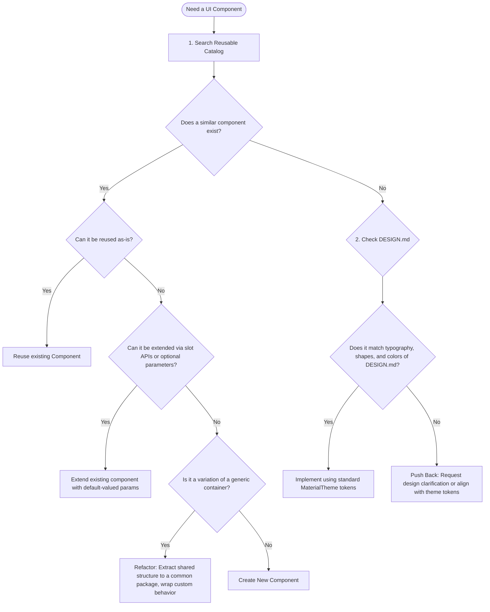

# Score-Count Compose Design System Guide

This document lists the reusable UI components, theme configurations, custom modifiers, and spacing scales in the Score-Count project. Use this guide to reuse components and maintain a consistent layout.

> [!IMPORTANT]
> **Normative Styles**: Tokens for colors, typography, shapes, and spacing are in [DESIGN.md](../DESIGN.md). Use `MaterialTheme` styles in code instead of hardcoded values.

---

## Reusable Modifiers and Helpers

Custom modifiers are in `com.soyvictorherrera.scorecount.ui.extension.ModifierExt.kt`:

*   **`Modifier.shimmering(minAlpha: Float = .25f)`**: Animates the alpha value of a component between `minAlpha` and `1.0f` every second. Used on the serving indicator icon.
*   **`Modifier.contentVerticalPadding(hasTopBar: Boolean)`**: Adds `16.dp` bottom padding if a top bar is present. Adds `16.dp` top and bottom padding if no top bar is present.

---

## Theme and Typography Standards

All UI screens must use dynamic values from `MaterialTheme` to support light and dark themes.

### Color Theme Slots
*   `MaterialTheme.colorScheme.primary`: Active outlines and selected states.
*   `MaterialTheme.colorScheme.secondary`: Container backgrounds for deuce status.
*   `MaterialTheme.colorScheme.surfaceVariant`: Background for active serving score cards.
*   `MaterialTheme.colorScheme.surfaceContainer`: Background for inactive player score cards.
*   `MaterialTheme.colorScheme.surfaceContainerHighest`: Background fill for small icon buttons.

### Typography Theme Slots (`Type.kt`)
*   `MaterialTheme.typography.displayLarge`: Player score text (`96.sp` black weight, -4.sp letter spacing).
*   `MaterialTheme.typography.headlineSmall`: Won sets count (`24.sp` bold).
*   `MaterialTheme.typography.titleSmall`: Section headers and small button labels (`14.sp` semi-bold).
*   `MaterialTheme.typography.bodyLarge`: Description text blocks (`16.sp` regular).
*   `MaterialTheme.typography.labelMedium`: Settings options and descriptions (`12.sp` medium).

---

## Reusable UI Components Catalog

Check these files before creating a new component.

### 1. Game & Score Components (`ui/scorescreen/components/`)

*   **[PlayerScoreCard.kt](../app/src/main/java/com/soyvictorherrera/scorecount/ui/scorescreen/components/PlayerScoreCard.kt)**: 
    *   *Purpose*: Renders a player's score card. Shows the score, name, and serving status. Tapping the card increments the score and triggers a vibration.
    *   *Props*: `state: PlayerScoreCardState` (playerName, score, isServing, isFinished), `showPlayerName: Boolean`, `onIncrement: () -> Unit`.
    *   *Design*: 28.dp rounded corners, active server outline, and variable opacity (0.85 normal, 1.0 serving, 0.75 finished).
*   **[DeuceIndicator.kt](../app/src/main/java/com/soyvictorherrera/scorecount/ui/scorescreen/components/DeuceIndicator.kt)**:
    *   *Purpose*: A green badge shown during a deuce tie.
    *   *Props*: `modifier: Modifier = Modifier`.
    *   *Design*: 12.dp rounded corners, secondary container background, with a 1.dp inner border of `onSecondary`.
*   **[GameSets.kt](../app/src/main/java/com/soyvictorherrera/scorecount/ui/scorescreen/components/GameSets.kt)**:
    *   *Purpose*: A blue pill-shaped badge showing the current set and set limit.
    *   *Props*: `matchNumber: Int`, `numberOfSets: Int`.
    *   *Design*: Primary background color, 28.dp rounded corners.
*   **[SetsIndicator.kt](../app/src/main/java/com/soyvictorherrera/scorecount/ui/scorescreen/components/SetsIndicator.kt)**:
    *   *Purpose*: Shows player names, sets won, and a separator.
    *   *Props*: `player1Name`, `player2Name`, `player1Sets`, `player2Sets`.
*   **[HorizontalMatchScore.kt](../app/src/main/java/com/soyvictorherrera/scorecount/ui/scorescreen/components/HorizontalMatchScore.kt)**:
    *   *Purpose*: A horizontal row showing set scores. Emphasizes the serving player with bold text.
    *   *Props*: `gameState: GameState`.
*   **[SmallIconButton.kt](../app/src/main/java/com/soyvictorherrera/scorecount/ui/scorescreen/components/SmallIconButton.kt)**:
    *   *Purpose*: A `32.dp` filled icon button for secondary actions.
    *   *Props*: `onClick`, `icon`, `description`, `enabled`.

### 2. Modal Pickers (`ui/scorescreen/components/` & `ui/settings/components/`)

*   **[BottomSheetPicker.kt (Generic)](../app/src/main/java/com/soyvictorherrera/scorecount/ui/scorescreen/components/BottomSheetPicker.kt)**:
    *   *Purpose*: A bottom sheet menu that displays a list of choices. Accepts a custom rendering block for each row.
    *   *Props*: `visible`, `onDismiss`, `title`, `options`, `onOptionSelected`, `optionContent: @Composable (T) -> Unit`.
*   **[BottomSheetPicker.kt (Settings)](../app/src/main/java/com/soyvictorherrera/scorecount/ui/settings/components/BottomSheetPicker.kt)**:
    *   *Purpose*: A bottom sheet menu showing list items with radio buttons, titles, and descriptions.
    *   *Props*: `visible`, `options`, `selectedOption`, `onOptionSelected`, `getOptionLabel`, `getOptionDescription`.
*   **[OverflowGameActionPicker.kt](../app/src/main/java/com/soyvictorherrera/scorecount/ui/scorescreen/components/OverflowGameActionPicker.kt)**:
    *   *Purpose*: A bottom sheet menu for actions that do not fit in the main control row.
    *   *Props*: `isVisible`, `onDismiss`, `actions`, `onActionSelected`.

### 3. Settings Screen Components (`ui/settings/components/`)

*   **[ToggleSettingCard.kt](../app/src/main/java/com/soyvictorherrera/scorecount/ui/settings/components/SettingsGrid.kt)**:
    *   *Purpose*: A settings card to toggle options. Highlights with primary colors when selected.
    *   *Props*: `item: SettingItemData.ToggleItem`.
    *   *Design*: 12.dp rounded corners, 120.dp height, primary border when checked, variant border when unchecked, 0.7 opacity when inactive.
*   **[SettingsGrid.kt](../app/src/main/java/com/soyvictorherrera/scorecount/ui/settings/components/SettingsGrid.kt)**:
    *   *Purpose*: A grid of settings cards. Shows 4 items per row in landscape and 2 in portrait.
*   **[StepperSettingItem.kt](../app/src/main/java/com/soyvictorherrera/scorecount/ui/settings/components/StepperSettingItem.kt)**:
    *   *Purpose*: A list item with minus and plus buttons to change a number.
*   **[SwitchSettingItem.kt](../app/src/main/java/com/soyvictorherrera/scorecount/ui/settings/components/SwitchSettingItem.kt)**:
    *   *Purpose*: A list item with a switch toggle.
*   **[PickerSettingItem.kt](../app/src/main/java/com/soyvictorherrera/scorecount/ui/settings/components/PickerSettingItem.kt)**:
    *   *Purpose*: A list item that shows a selected value and opens a selection sheet when tapped.

---

## Reuse vs. Extension Decision Workflow

Before writing a new component, follow this workflow to check if you can reuse or extend an existing one:

### Pre-Development Checklist
1.  **Duplicate Check**: Have I searched `/scorescreen/components` and `/settings/components` for a similar widget?
2.  **Compose Slot Suitability**: Can I add a `content: @Composable () -> Unit` parameter to the existing component?
3.  **Default Parameter Additions**: Can I add optional parameters with default values instead of copying the component?
4.  **Token Conformity**: Does the code use hardcoded colors or sizes? (If yes, use `MaterialTheme` references).
5.  **Placement Rule**: If a component is used on multiple screens, move it to a shared `ui/components/` package.
